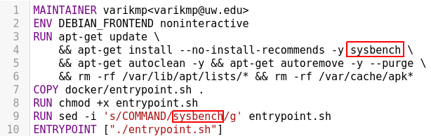
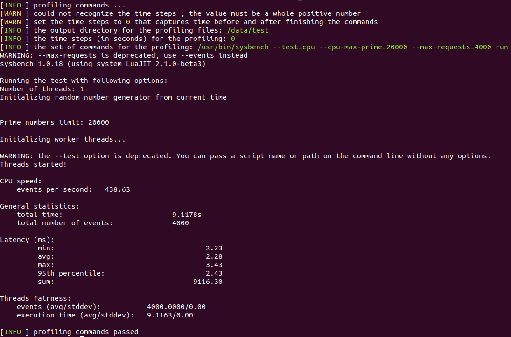
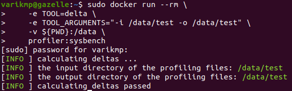
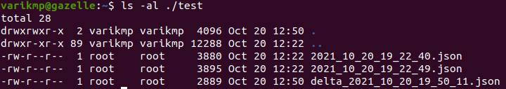
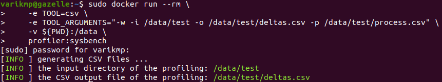
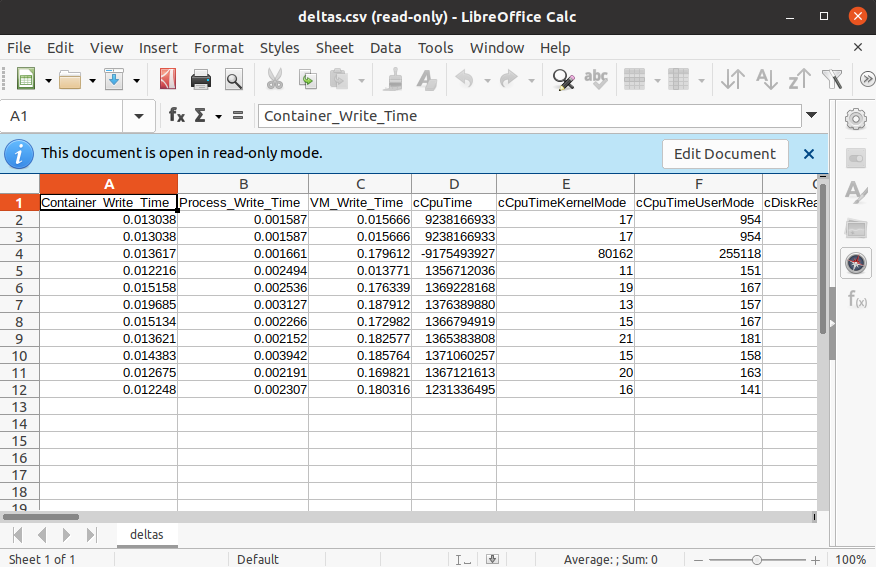
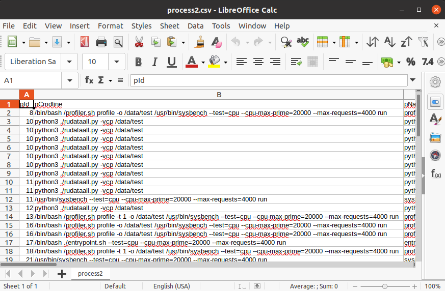

# Table of Contents

FILL UP LATER

<!---
please identify container profiler use case.  have added these to the google doc task list. 
assume this is the use case where the user has "no container" and wants to profile a task --->
## How do I build the ContainerProfiler with additional software

Here is an example of having a software (sysbench) installed in the ContainerProfiler

We create a docker file **sysbench.docker** in the directory **./docker** as the picture shown below



We are now ready to build a container image including ContainerProfiler and a software (sysbench). To build our custom container image, we run the command:

```bash
./build --docker-file ./docker/sysbench.docker
```

To check if our docker image was built correctly, we run the command:

```bash
sudo docker images | grep profiler
```


The picture above tells us that we successfully built our container image including ContainerProfiler and a software (sysbench)

## How do I test the ContainerProfiler with additional software that I built

Here is an example of CPU performance test using sysbench

```bash
sysbench --test=cpu --cpu-max-prime=20000 --max-requests=4000 run
```

To profile the command above, we run the docker command:

```bash
sudo docker run --rm \
    -e TOOL=profile \
    -e TOOL_ARGUMENTS="-o /data/test" \
    -v ${PWD}:/data \
    profiler:sysbench --test=cpu --cpu-max-prime=20000 --max-requests=4000 run
```

Make sure that we specify the TOOL (do the profiling) and the TOOL_ARGUMENTS indicating the output directory that holds profiling files in JSON format



The profiling is successfully executed. Let's check the profiling files in **./test** directory.


Note: to make a time series of an execution, we simply add "-t 1" to the TOOL_ARGUMENTS environmental variable

## How do I calculate the deltas between the profiling files

To generate the delta files between profiling files, we run the docker command below:

```bash
sudo docker run --rm \
    -e TOOL=delta \
    -e TOOL_ARGUMENTS="-i /data/test -o /data/test" \
    -v ${PWD}:/data \
    profiler:sysbench
```

We need to specify environmental variables:
- TOOL **delta** 
- TOOL_ARGUMENTS
	+ -i for the input directory including profiling files
	+ -o for the output directory to produce delta files



When the delta calculation is done, we should see the delta files in **./test** directory.



## How do I generate the CSV files from the delta files

To generate CSV files relative to the deltas and/or processes, we run the docker command below:

```bash
sudo docker run --rm \
    -e TOOL=csv \
    -e TOOL_ARGUMENTS="-w -i /data/test -o /data/test/deltas.csv -p /data/test/process.csv" \
    -v ${PWD}:/data \
    profiler:sysbench
```

We need to specify environmental variables:
- TOOL **csv** 
- TOOL_ARGUMENTS
	+ -i for the input directory including delta files
	+ -o for the output CSV file of deltas
	+ -p for the output CSV file of processes



There are two CSV files generated: deltas.csv and processes.csv





