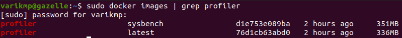
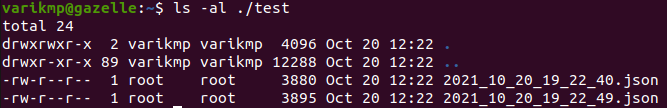

# Table of Contents
   * [Build ContainerProfiler with a task or an application](#How-do-I-build-a-Docker-Container-that-integrates-the-ContainerProfiler-to-profile-a-task-or-application)
   * [Build ContainerProfiler with additional software using my own script](#How-do-I-build-the-ContainerProfiler-with-additional-software-using-my-own-script)
     * [Perform time series sampling of the task or application using the installation script](#How-do-I-perform-time-series-sampling-of-the-task-or-application-installed-using-the-installation-script)
     * [Compute the delta statistics of resource utilization between time instances](#Delta-a-tool-is-to-compute-the-delta-statistics-of-resource-utilization-between-time-instances)
     * [Generate the statistics of resource utilization in JSON format](#CSV-generator-a-tool-is-to-generate-the-statistics-of-resource-utilization-in-JSON-format)
     * [Make graph based on the statistic CSV file](#Graph-a-tool-is-to-make-graph-based-on-the-statistic-CSV-file)

<!---which container profiler use case is this from the 4 listed in the ContainerProfiler google doc task list ?
  --->
## How do I build a Docker Container that integrates the ContainerProfiler to profile a task or application 

Here is a ready-to-use ContainerProfiler Docker container that is preconfigured to profile the sysbench benchmark application.
This container can be customized to profile any program or task.

As a starting point, a preconfigured docker file **sysbench.docker** is provided in the directory **./docker** as shown below:


First build the Docker container image for this example which incorporates the ContainerProfiler and the sysbench benchmark application. To build the container image, run the command:

<!--- is this supposed to be build.sh ??? --->
<!--- should this be run with sudo ??? --->
<!--- this does not appear to match command: sudo ./build.sh -d docker/sysbench.docker  --->
<!--- command below does not seem correct - does not build container with sysbench --->
```bash
sudo ./build --docker-file ./docker/sysbench.docker
```

To check if our docker image was built correctly, we run the command:

```bash
sudo docker images | grep profiler
```



The picture above tells us that we successfully built our container image including ContainerProfiler and a software (sysbench)

## How do I test the ContainerProfiler with additional software that I built

Here is an example of CPU performance test using sysbench

```bash
sysbench --test=cpu --cpu-max-prime=20000 --max-requests=4000 run
```

To profile the command above, we run the docker command:

```bash
sudo docker run --rm \
    -e TOOL=profile \
    -e TOOL_ARGUMENTS="-o /data/test" \
    -v ${PWD}:/data \
    profiler:sysbench --test=cpu --cpu-max-prime=20000 --max-requests=4000 run
```

Make sure that we specify the TOOL (do the profiling) and the TOOL_ARGUMENTS indicating the output directory that holds profiling files in JSON format


The profiling is successfully executed. Let's check the profiling files in **./test** directory.



Note: to make a time series of an execution, we simply add "-t 1" to the TOOL_ARGUMENTS environmental variable

## How do I calculate the deltas between the profiling files

To generate the delta files between profiling files, we run the docker command below:

```bash
sudo docker run --rm \
    -e TOOL=delta \
    -e TOOL_ARGUMENTS="-i /data/test -o /data/test" \
    -v ${PWD}:/data \
    profiler:sysbench
```

We need to specify environmental variables:
- TOOL **delta** 
- TOOL_ARGUMENTS
	+ -i for the input directory including profiling files
	+ -o for the output directory to produce delta files


When the delta calculation is done, we should see the delta files in **./test** directory.


## How do I generate the CSV files from the delta files

To generate CSV files relative to the deltas and/or processes, we run the docker command below:

```bash
sudo docker run --rm \
    -e TOOL=csv \
    -e TOOL_ARGUMENTS="-w -i /data/test -o /data/test/deltas.csv -p /data/test/process.csv" \
    -v ${PWD}:/data \
    profiler:sysbench
```

We need to specify environmental variables:
- TOOL **csv** 
- TOOL_ARGUMENTS
	+ -i for the input directory including delta files
	+ -o for the output CSV file of deltas
	+ -p for the output CSV file of processes


There are two CSV files generated: deltas.csv and processes.csv


# How do I build the ContainerProfiler with additional software using my own script


Here the installation script should install all software dependencies required to run the application.
It is not necessary to preface installation commands with 'sudo'.

```bash
sudo ./build.sh -i INSTALL_SCRIPT_PATH
```

For example:

```bash
sudo ./build.sh -i docker/install.sh
```

You will be asked to enter an entry point based on the software you attempt to install in your install script.
The entry point is the name of the command (without any arguments) that will be run.
For example, if the installation script installs sysbench, then the name of the command will be 'sysbench'.
Later, when running the container you do not need to specify the command again, but just the arguments that are to be passed to the command.

## How do I profile a task or application installed using the installation script

After the container name 'profiler:sysbench' you will need to specify the command line arguments
for the application being profiled.

```bash
sudo docker run --rm \
    -e TOOL=profile \
    -e TOOL_ARGUMENTS="-o /data" \
    -v ${PWD}:/data \
    profiler:CONTAINER_TAG YOUR_ARUMENTS_GO_HERE
```

For example:

```bash
sudo docker run --rm \
	-e TOOL=profile \
	-e TOOL_ARGUMENTS="-o /data" \
	-v ${PWD}:/data \
	 profiler:sysbench --test=cpu --cpu-max-prime=20000 --max-requests=4000 run
```

## How do I perform time series sampling of the task or application installed using the installation script

After the container name 'profiler:sysbench' you will need to specify the command line arguments
for the application being profiled.

In addition, add the '-t' argument to specify a time series sampling interval.  (e.g. '-t 1' for 1-second sampling)

```bash
sudo docker run --rm \
    -e TOOL=profile \
    -e TOOL_ARGUMENTS="-t TIME_INTERVAL -o /data" \
    -v ${PWD}:/data \
    profiler:CONTAINER_TAG YOUR_ARUMENTS_GO_HERE
```

For example:

```bash
sudo docker run --rm \
	-e TOOL=profile \
	-e TOOL_ARGUMENTS="-t 1 -o /data" \
	-v ${PWD}:/data \
	 profiler:sysbench --test=cpu --cpu-max-prime=20000 --max-requests=4000 run
```

## Delta: a tool is to compute the delta statistics of resource utilization between time instances

After receiving profiling files from the previous step, we run the delta option to generate delta statistics in JSON format.

Short Name | Long Name | Optional | Descriptions
--- | --- | --- | ---
-i | --input-directory | No | specify the input directory for calculating aggregate values in JSON format
-o | --output-directory | No | specify the output directory for calculating aggregate values in JSON format
-a | --aggregate-config-file | Yes | specify the aggregate configuration file
-c | --clean-up | Yes | clean up the aggregate files from the previous run

```bash
sudo docker run --rm \
	-e TOOL=delta \
	-e TOOL_ARGUMENTS="-i /data -o /data" \
	-v ${PWD}:/data \
	 profiler:sysbench
```

## CSV generator: a tool is to generate the statistics of resource utilization in JSON format

We need to specify the directory that holds statistic files. Those files are generated from the delta tool.

Short Name | Long Name | Optional | Descriptions
--- | --- | --- | ---
-i | --input-directory | No | specify the input directory of aggregate files
-o | --csv-output-file | No | specify the output file for CSV file generation
-w | --overwrite | Yes | overwrite the CSV file from the previous run

```bash
sudo docker run --rm \
	-e TOOL=csv \
	-e TOOL_ARGUMENTS="-i /data -o /data/delta.csv" \
	-v ${PWD}:/data \
	 profiler:sysbench
```

## Graph: a tool is to make graph based on the statistic CSV file

The tool generate the graphs based on the statistic file in CSV format. Also, we can provide the metric configuration file for the graphs.

Short Name | Long Name | Optional | Descriptions
--- | --- | --- | ---
-r | --csv-input-file | No | specify the aggregate CSV file
-m | --metric-input-file | Yes | specify the metric file specifying metrics for graphing
-g | --graph-output-directory | No | specify the output directory for graph images
-s | --single-plot | Yes | plot single curve on a graph


```bash
sudo docker run --rm \
	-e TOOL=graph \
	-e TOOL_ARGUMENTS="-i /data -o /data" \
	-v ${PWD}:/data \
	 profiler:sysbench
```
